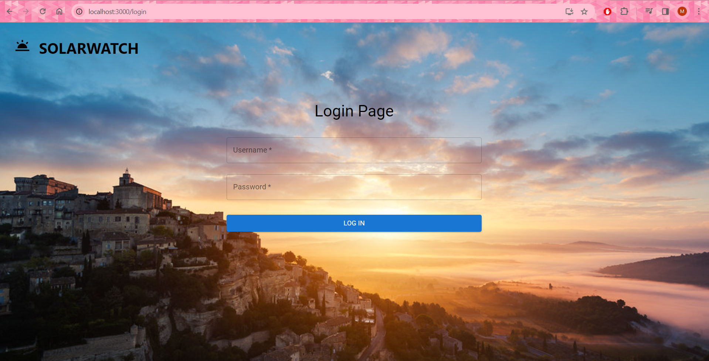
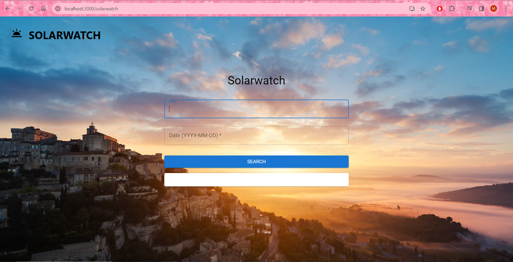
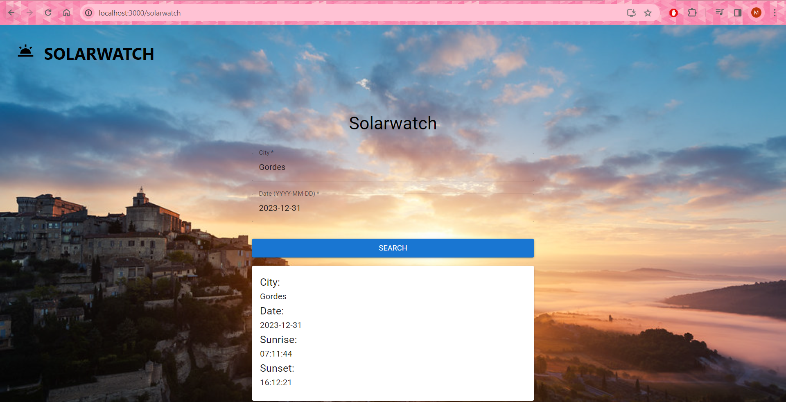

# solar-watch

Here you can find repository with frontend part for this project:

- [Frontend part](https://github.com/CodecoolGlobal/solarwatch-frontend-javascript-magdalenahuget)


## Table of Contents
* [General Info](#general-information)
* [Technologies Used](#technologies-used)
* [Features](#features)
* [Screenshots](#screenshots)
* [Setup](#setup)
* [Usage](#usage)
* [Project Status](#project-status)
* [Room for Improvement](#room-for-improvement)
* [Authors](#authors)

## General Information
This project allowed me to gain all the most important information I needed to start building, running, and testing web applications on my own.

## Technologies Used
- Java - version 17.0.0
- Spring Boot - version 3.1.5
- PostgreSQL 15.3

## Features
- Building a Spring Boot Web API
- Interact with other APIs
- Unit testing in Spring Boot
- How to add Spring Data JPA to a Spring Boot project
- How to create entity relationships 
- Use PostgreSQL database with Spring Data JPA
- Adding Spring Security to an existing project
- How to define Data Models and associations for Authentication and Authorization
- Way to use Spring Data JPA to interact with PostgreSQL Database in the context of Spring Security
- Testing the web layer of a Spring Boot application
- Integration Testing With @SpringBootTest
- Using in-memory database for integration tests
- Using MockWebServer to mock external Web APIs in integration tests

## Screenshots








## Setup
1. *Install Git* - Make sure you have the Git version control system installed on your computer.
2. *Clone Repository* - Copy the project repository URL and clone it on your local computer using the following command in the terminal:

```
git clone <repository-url>
```

3. *Configure application* - Contact the project maintainers for configuration file. Set up PostgreSQL the database. Make sure to configure the backend files and database connections as needed.
4. *Run the Application* - After completing the above steps, you can now run the application.

## Usage
For all sun lovers to check what time the sun rises and sets in every corner of the world

## Project Status
Project is: _completed_

## Room for Improvement
Improve user interface to implement all backend features.

## Authors
Magdalena Huget